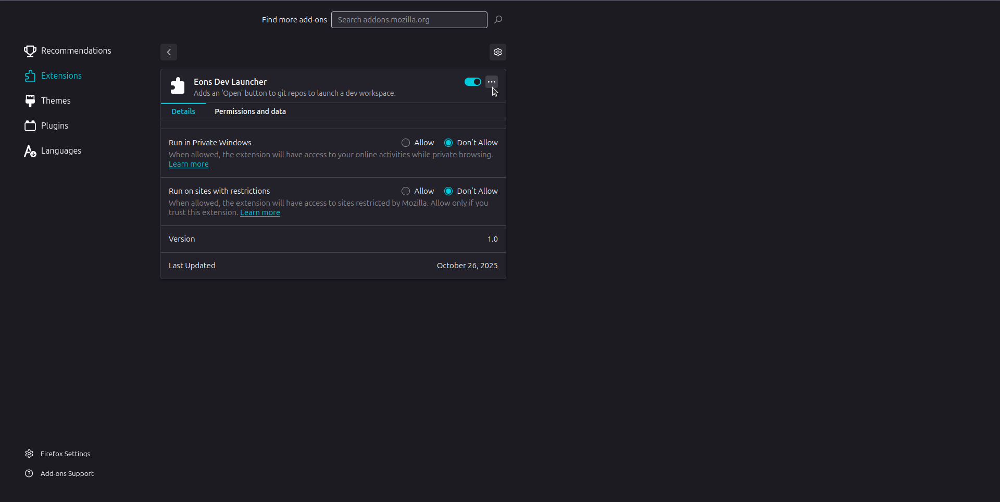

# Eons Dev Launcher

**Eons Dev Launcher** is a lightweight browser extension that injects an **"Open"** button on GitHub, GitLab, and [git.infrastructure.tech](https://git.infrastructure.tech) repository pages. Clicking this button launches the current repository in a **workspace environment** such as **Kasm** or **Coder**.

For Kasm:

```
https://workspace.infrastructure.tech/#/cast/dev?kasm_url=<CURRENT_REPO_URL>
```

For Coder:

```
https://coder.example.com/templates/devcontainer/workspace?param.repo_url=<CURRENT_REPO_URL>
```

Originally forked from [Gitpod's browser extension](https://github.com/gitpod-io/browser-extension) and rebuilt for cross-platform compatibility (Linux, macOS, Windows) and modern build tooling.

## How It Works

The extension injects a lightweight content script that:

1. Detects when you're viewing a supported repository (GitHub, GitLab, or git.infrastructure.tech)
2. Injects an **"Open"** button near the repo title or toolbar
3. When clicked, it opens one of the following, depending on configuration:

   - Kasm: `https://workspace.infrastructure.tech/#/cast/dev?kasm_url=<CURRENT_REPO_URL>`
   - Coder: `https://coder.example.com/templates/devcontainer/workspace?param.repo_url=<CURRENT_REPO_URL>`

## Features

- Adds an **"Open"** button on GitHub, GitLab, and git.infrastructure.tech repositories
- Opens the repo in a dev workspace platform like **Kasm** or **Coder** with a single click
- Works seamlessly on **Chrome** and **Firefox**
- Lightweight—no tracking, no telemetry, no accounts required
- Fully open-source under the MIT license
- **Liquid.js templating support** for flexible URL customization with dynamic variables

## Customization

You can configure the workspace URL using **Liquid.js templating** to create dynamic, flexible URLs.

### Available Template Variables

- `{{repoUrl}}` - The full URL of the current repository page
- `{{branchName}}` - The branch name extracted from the current URL (if viewing a specific branch)

### Change the URL Template

1. Open the extension's **Options** page:

   - **Chrome:** `chrome://extensions` → **Eons Dev Launcher** → **Details** → **Extension options**

   

   - **Firefox:** Right-click the extension icon → **Manage Extension** → kebab → **Preferences**

   

2. Enter a custom workspace URL template using Liquid.js syntax:

   **Basic Kasm template:**

   ```
   https://workspace.infrastructure.tech/#/cast/dev?kasm_url={{repoUrl}}
   ```

   **Coder template with branch name (first 20 characters):**

   ```
   https://coder.example.com/templates/devcontainer/workspace?name={{branchName|slice:0,20}}&param.repo_url={{repoUrl}}
   ```

   **Important:** Liquid.js filter syntax requires **no spaces** around colons and commas in filter arguments.  
   Unfortunately, the stored templates are currently encoded, so spaces, quotes, or other invalid characters will cause rendering errors.

   ✅ **Correct:**

   ```
   {{branchName|slice:0,20}}
   ```

   ❌ **Incorrect (will cause errors):**

   ```
   {{branchName | slice: 0, 20}}
   ```

   

3. Save changes—the button will now open your custom environment with the rendered template.

## Development Setup

### 1. Clone the repository

```bash
git clone https://git.infrastructure.tech/eons/ext/browser/dev.workspace.git
cd dev.workspace
```

### 2. Install dependencies

```bash
pnpm install
```

### 3. Build for your target browser

You can build both versions or just one, depending on your needs.

All builds output to the same `eons-dev-launcher/` folder.

It is recommended to clean the output folder between builds if switching browsers.

#### Chrome build

```bash
pnpm run build:chrome
```

#### Firefox build

```bash
pnpm run build:firefox
```

The Firefox build automatically injects the required `"browser_specific_settings"` → `gecko.id` block for AMO signing and installs.

## Loading the Extension (Development Mode)

### Chrome / Chromium / Edge

1. Open `chrome://extensions`
2. Enable **Developer mode** (toggle in the top-right corner)
3. Click **Load unpacked**
4. Select the `eons-dev-launcher/` folder
5. The "Eons Dev Launcher" icon will appear in your toolbar.

### Firefox

1. Open `about:debugging#/runtime/this-firefox`
2. Click **Load Temporary Add-on**
3. Select the `manifest.json` inside the `eons-dev-launcher/` folder
4. The extension will appear in your toolbar for this session.

Note: Temporary add-ons are removed when Firefox restarts.

## License

MIT © [Eons LLC](https://infrastructure.tech)
