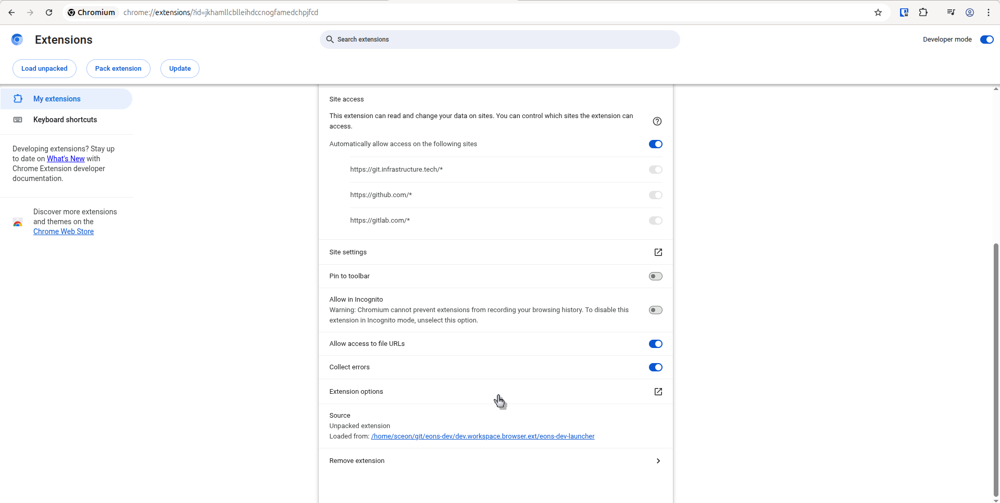
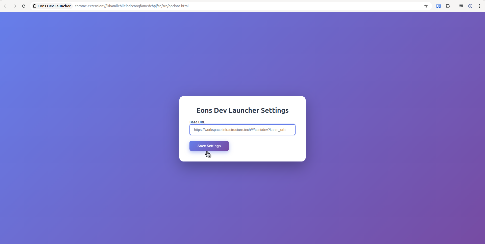

# Eons Dev Launcher

**Eons Dev Launcher** is a lightweight browser extension that injects an **"Open"** button on GitHub, GitLab, and [git.infrastructure.tech](https://git.infrastructure.tech) repository pages. The button opens the current repository in a Kasm workspace at:

```
https://workspace.infrastructure.tech/#/cast/dev?kasm_url=<CURRENT_REPO_URL>
```

Original code taken from [gitpod](https://github.com/gitpod-io/browser-extension) and rebuilt to build on linux, etc.

---

## Features

- Adds an **"Open"** button directly on GitHub, GitLab, and git.infrastructure.tech pages  
- Launches a new development workspace for the current repo  
- Minimal, no tracking, no accounts 
- Only supports **Chrome** at the moment (Firefox support coming soon)

---

## Installation

### For Development

1. Clone the repo:

   ```bash
   git clone https://git.infrastructure.tech/eons/ext/browser/dev.workspace.git
   cd dev.workspace
   ```

2. Install dependencies:

   ```bash
   pnpm install
   ```

3. Build the extension:

   ```bash
   pnpm build
   ```

4. Load into your browser:

   - **Chrome**:  
     - Go to `chrome://extensions`  
     - Enable **Developer Mode**  
     - Click **Load unpacked** → Select the `eons-dev-launcher/` folder

   - **Firefox**:  
     - Go to `about:debugging#/runtime/this-firefox`  
     - Click **Load Temporary Add-on**  
     - Choose the generated `manifest.json` inside `eons-dev-launcher/`

---

## How it Works

The extension uses a content script to:
- Detect repo pages
- Inject an `"Open"` button near the repo title
- Link it to a pre-configured workspace URL with the current page as a parameter

---

## Customization

To point to a different workspace:

1. Go to the extension's options page:
   - **Chrome**: `chrome://extensions` → Find **Eons Dev Launcher** → Click **Details** → Click **Extension options**

   

2. Enter your desired base URL (e.g. `https://workspace.infrastructure.tech/#/cast/dev?kasm_url=`)

   


---

## License

MIT © [Eons](https://infrastructure.tech)

